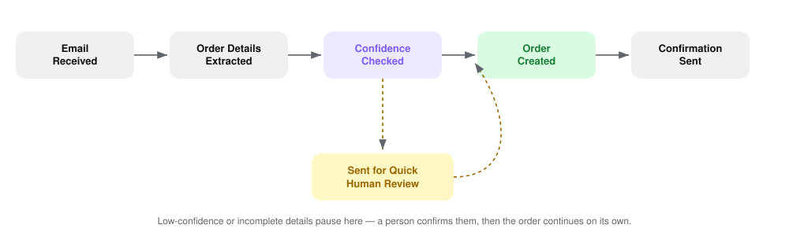

# Email Based Order Intake System

A smart automation tool that turns customer order emails into ready-to-approve orders — accurately, at scale, and without losing the human touch where it actually matters.

---

## How it Works

**The key idea:** the process only ever pauses for the one thing a machine genuinely can't be fully sure about — a detail it isn't confident it read correctly. Everything else happens automatically.

---

## The Solution We Provide

Businesses that take orders over email often get the *same kind of order* from dozens or hundreds of customers, written in every possible style — neat purchase orders, quick WhatsApp-style notes, even scanned receipts. Reading each one, picking out the customer, products, quantities and price, and typing it into the order system by hand is slow, and it's easy to miss something.

This tool solves that by:

- **Watching the inbox for you**, picking up every new order email the moment it arrives
- **Reading the email like a person would** — whether it's a formal purchase order, a casual message, or even mixed English–Urdu text — and pulling out the customer, items, quantities, price and delivery address
- **Never guessing silently** — every extracted detail carries a confidence score, and anything it isn't sure about is set aside for a quick human check instead of being approved blindly
- **Keeping a full record** of every email received, what was pulled from it, and what happened to it

The result: what used to be minutes of reading and retyping per order becomes a single glance and a click, with a person only ever touching the small share of orders that genuinely need a second look.

---

## What Makes This Different (Market Gap)

Most order-handling approaches fall into one of two broken extremes:

- **Fully manual** reading and re-typing — reliable, but slow and doesn't scale as order volume grows.
- **Fully "hands-off" automation** — fast, but risky: it either forces every order into one rigid format, or it quietly accepts a misread detail with no one noticing until a customer complains.

This system is built for the space in between: **it reads and structures every order automatically, and only ever hands off the details it's genuinely unsure about — in real time, before anything is finalized.** That combination of flexible reading (plain English, casual phrasing, even Roman Urdu) with a visible confidence check on every field is what makes it safe to trust with real customer orders, not just tidy ones.

---

## See It In Action

**Review Queue** — every incoming order lands here with its details already pulled out. Each field shows how confident the system is, so it's obvious at a glance what's safe to approve and what deserves a second look, before a single click confirms the order.

**Overview** — a simple, at-a-glance summary of how many orders came in, how many were approved automatically, how many needed a human check, and how well the system is reading incoming emails overall.

---

## What It Extracts

| Field            | Example                                             |
| ---------------- | --------------------------------------------------- |
| Customer Name    | Ayesha Khan                                         |
| Customer Email   | [ayesha.khan@brightretail.pk](mailto:ayesha.khan@brightretail.pk) |
| Product          | A4 Copy Paper (80gsm, 500 sheets)                   |
| Quantity         | 20 reams                                            |
| Unit Price       | Rs. 1,150                                           |
| Delivery Address | 14-B Gulberg III, Lahore                            |
| Order Date       | 12 July 2026                                        |

---

## Who It's For

* Businesses that take customer orders over email
* Wholesale and distribution companies
* Retail businesses with email-based ordering
* Suppliers receiving purchase requests
* Organizations processing bulk product orders
* Any team moving from manual order entry to automation

---

## In Summary

What used to take minutes of careful reading and re-typing per order now takes a single glance and a click — with the reliability of a person quietly watching over the small share of orders that truly need one. It's built to save time, cut mistakes, and scale effortlessly as order volume grows, without ever compromising on accuracy.

> **Email Received → Order Details Extracted → Confidence Checked → Order Created → Confirmation Sent**
