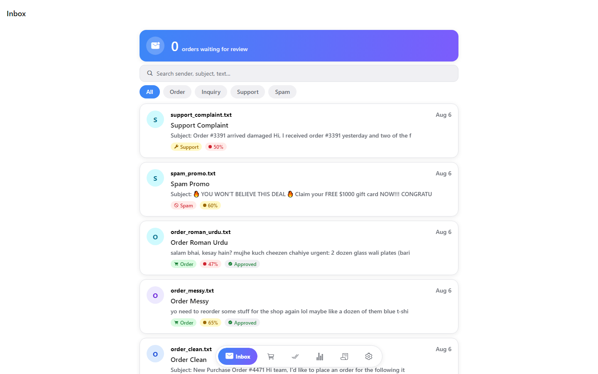

# AI Email Order Intake — Review Dashboard

This is the screen where your team reviews customer orders that arrive by email.

Customers email you their orders in all kinds of ways — a clear list, a messy
one-liner, even Roman Urdu ("bhai mujhe 2 piece chahiye..."). Instead of someone
manually reading every email and typing the order into your system, the AI
reads the email first and pulls out the details on its own: customer name,
items, quantities, prices, address. All your team has to do is glance at it,
fix anything that looks off, and approve it.

## What you can do here

- **See every incoming email in one place**, already sorted into Order,
  Inquiry, Support, or Spam — so genuine orders never get lost in the noise.
- **Review side-by-side**: the original email on one side, the AI's extracted
  order details on the other — no guessing what the AI based its answer on.
- **Edit anything before approving.** If the AI got a name or quantity wrong,
  just fix it — that correction quietly helps the AI get better over time.
- **Approve or reject** an order in one tap, and it moves straight into your
  order system.
- **Track what's pending vs. already approved**, and see simple stats — how
  many emails came in, how many were genuine orders, how confident the AI was.
- **Sign in with your own account** — every team member gets their own login,
  so it's always clear who reviewed and approved what.

This dashboard works the same whether you're on a computer, tablet, or phone.
